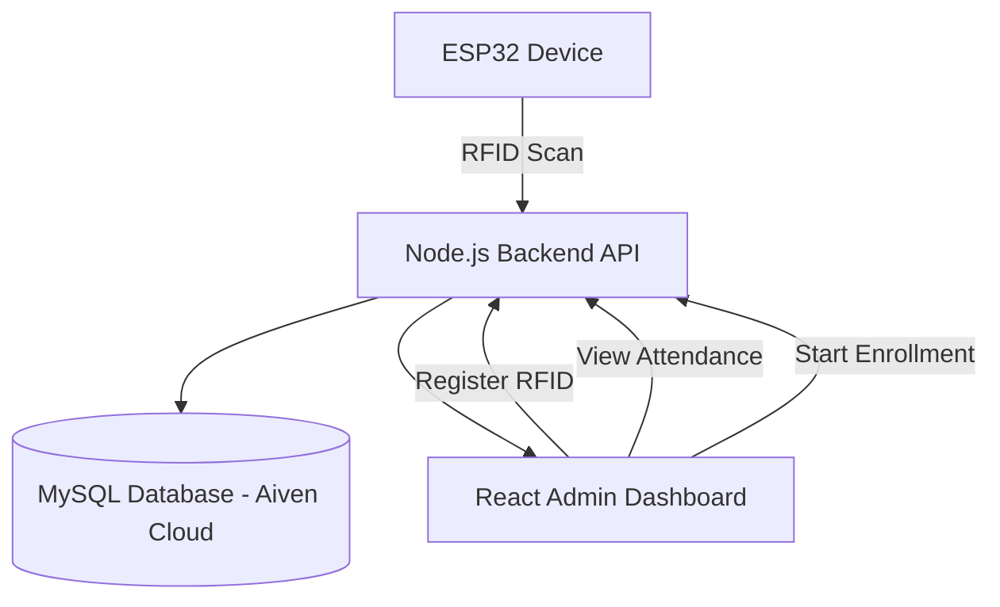
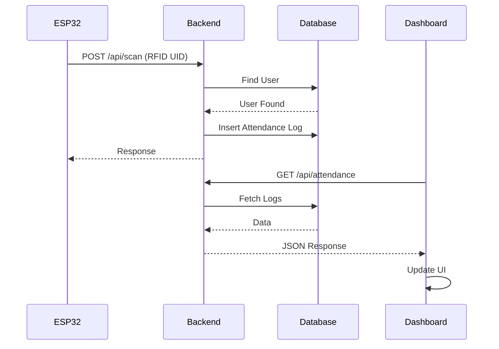
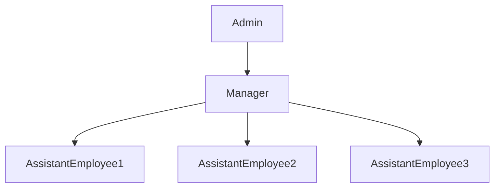

# RFID-Based Attendance Logging System


A **real-time RFID-based attendance management system** built using **ESP32, Node.js, MySQL, and React**.  
The system allows organizations to **register employees, track attendance using RFID cards, and monitor activity in real time through a web dashboard**.

---

## Project Overview

This project demonstrates how **IoT devices can integrate with a full-stack web application** to create an automated attendance logging system.

Key capabilities include:

- RFID-based employee authentication
- Real-time attendance tracking
- Role-based employee hierarchy
- Admin dashboard for system management
- ESP32 device integration
- Cloud database storage
- Automated attendance status toggling (IN / OUT)

---

## System Architecture



---

## Live System Workflow



---

## Role Hierarchy



---
A **real-time attendance management system** using RFID technology, ESP32 devices, and a full-stack web dashboard.  
The system enables organizations to **track employee attendance, manage roles, and monitor check-in/check-out activity in real time**.

---

## Features

### RFID Attendance Logging
- Employees tap RFID cards to **check IN / OUT**
- System automatically **toggles attendance status**
- Attendance records are stored in the database

---

### Role-Based Access

The system supports three types of users:

| Role | Permissions |
|-----|-------------|
Admin | Full system control |
Manager | View attendance of assigned employees |
Assistant Employee | Mark attendance via RFID |

---

### Admin Dashboard

The Admin Dashboard provides:

- RFID card registration
- Employee role assignment
- Department assignment
- Manager assignment
- Real-time attendance monitoring
- Attendance statistics
- Activity logs
- CSV report export
- RFID enrollment mode

---

### RFID Enrollment Mode

Admin can enable **Enrollment Mode** to register new cards.

**Process:**

1. Admin clicks **Start Enrollment**
2. User taps an RFID card
3. UID is captured automatically
4. Admin enters employee details
5. User is registered in the system

---

## Tech Stack

### Hardware
- ESP32
- RFID Reader (RC522 or simulated ESP32 requests)

### Backend
- Node.js
- Express.js
- MySQL
- Aiven Cloud Database

### Frontend
- React.js
- Tailwind CSS
- Lucide Icons

### Communication
- REST API
- HTTP requests from ESP32

---

## Project Structure

```
RFID-based-Attendance-Logging-System
│
├── backend
│   ├── index.js
│   └── db.js
│
├── frontend
│   └── RFIDDashboard.jsx
│
├── esp32
│   └── esp32_simulation.ino
│
├── .gitignore
└── README.md
```

---

## Database Schema

### Users Table

| Field | Description |
|-----|-------------|
user_id | Unique user identifier |
name | Employee name |
rfid_uid | RFID card UID |
role | admin / manager / assistant_employee |
department | Department name |
manager_id | Assigned manager |

---

### Device Table

| Field | Description |
|-----|-------------|
device_id | Unique device id |
location | Location of the device |

---

### Attendance Logs Table

| Field | Description |
|-----|-------------|
log_id | Unique log entry |
user_id | Employee reference |
scan_type | IN / OUT |
device_id | Device identifier |
scan_time | Timestamp |

---

## API Endpoints

### Get Attendance

```
GET /api/attendance
```

Returns current attendance status of all users.

---

### Add RFID User

```
POST /api/rfid
```

Example request:

```json
{
  "rfid": "UID123",
  "name": "John",
  "role": "assistant_employee",
  "department": "Engineering",
  "manager_id": 2
}
```

---

### RFID Scan

```
POST /api/scan
```

Example request:

```json
{
  "rfid_uid": "UID123",
  "device_id": "ENTRANCE_GATE"
}
```

---

### Start Enrollment Mode

```
POST /api/enroll/start
```

---

### Stop Enrollment Mode

```
POST /api/enroll/stop
```

---

### Get Last Enrollment UID

```
GET /api/enroll/latest
```

---

## ESP32 Simulation

For testing without RFID hardware, the ESP32 can simulate card scans by sending requests to:

```
POST /api/scan
```

Example payload:

```json
{
  "rfid_uid": "TEST_RFID_001",
  "device_id": "ESP32_TEST"
}
```

---

## Hardware Connections

### RC522 RFID Reader → ESP32

| RC522 Pin | ESP32 Pin |
|-----------|-----------|
| SDA (SS)  | GPIO 27   |
| SCK       | GPIO 18   |
| MOSI      | GPIO 23   |
| MISO      | GPIO 19   |
| RST       | GPIO 14   |
| 3.3V      | 3.3V      |
| GND       | GND       |

⚠️ **Important:** The RC522 module operates on **3.3V only**. Supplying 5V may damage the module.

---

### I2C LCD Display → ESP32

| LCD Pin | ESP32 Pin |
|--------|-----------|
| SDA    | GPIO 21   |
| SCL    | GPIO 22   |
| VCC    | VIN / 5V  |
| GND    | GND       |

The LCD communicates with the ESP32 using the **I2C protocol**, requiring only two data lines.

---

### Buzzer → ESP32

| Buzzer Pin | ESP32 Pin |
|-----------|-----------|
| + (Signal) | GPIO 15 |
| – (GND) | GND |

The buzzer provides **audio feedback** for system events such as:

- Successful RFID scan
- Attendance marked (IN / OUT)
- Invalid or unregistered card detection

---

### Hardware Components Used

- **ESP32** – Microcontroller handling WiFi communication and API requests  
- **RC522 RFID Reader** – Reads RFID card UID  
- **I2C LCD Display** – Displays system messages (e.g., *Scan Card*, *Access Granted*)  
- **Buzzer** – Provides audible feedback during scans

## Installation

### Clone Repository

```
git clone https://github.com/Jarvis-the-og/RFID-based-Attendance-Logging-System.git
```

---

### Backend Setup

```
cd backend
npm install
node index.js
```

---

### Frontend Setup

```
cd frontend
npm install
npm start
```

---

## Environment Variables

Create a `.env` file inside the backend folder.

```
DB_HOST=
DB_PORT=
DB_USER=
DB_PASSWORD=
DB_NAME=
```

---

## Demo Workflow

1. Start backend server
2. Start frontend dashboard
3. Register employee RFID
4. Tap RFID card using ESP32
5. Attendance is logged automatically
6. Dashboard updates in real time

---

## Security

Sensitive files are excluded using `.gitignore`.

Ignored files include:

- `.env`
- `ca.pem`
- `node_modules`
- build artifacts

---

## Future Improvements

- Manager dashboard
- WebSocket-based real-time updates
- Mobile application support
- Multi-device attendance gates
- Face recognition fallback

---

## Author

**Rishabh Dev**

GitHub:  
https://github.com/Jarvis-the-og
